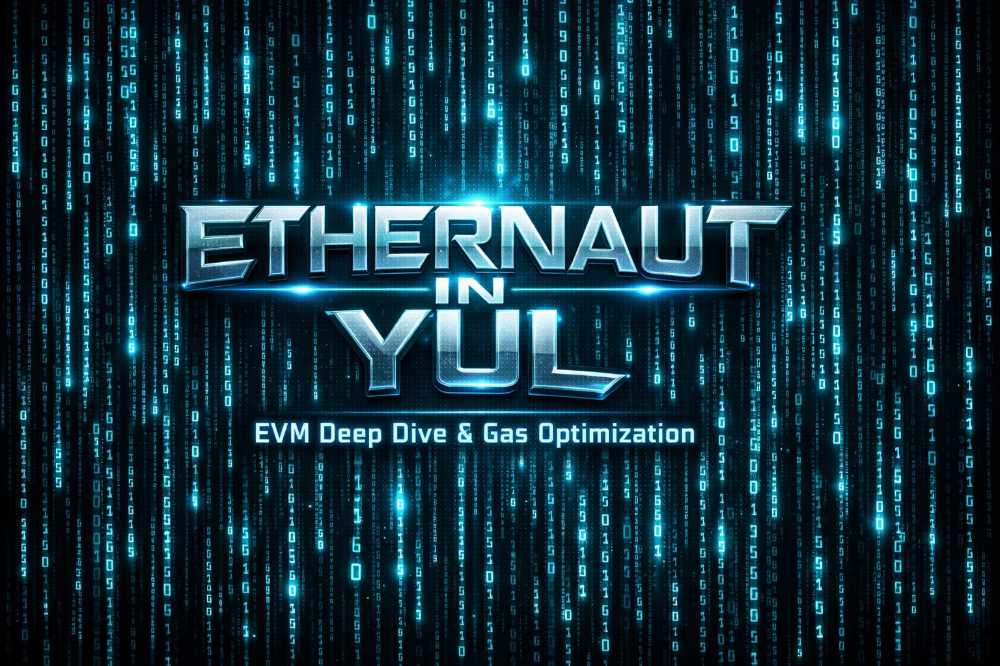

  
   
   
  <h3>
    <i>"Solidity hides the machine. Yul reveals it."</i>
  </h3>
  
  
  

   
   
  

    A collection of <b>pure Assembly solutions</b> for OpenZeppelin's Ethernaut CTF. 
    Demonstrating how to interact directly with the Stack, Memory, and Storage  
    to achieve <b>maximum efficiency</b> and <b>surgical precision</b>.
  

---
