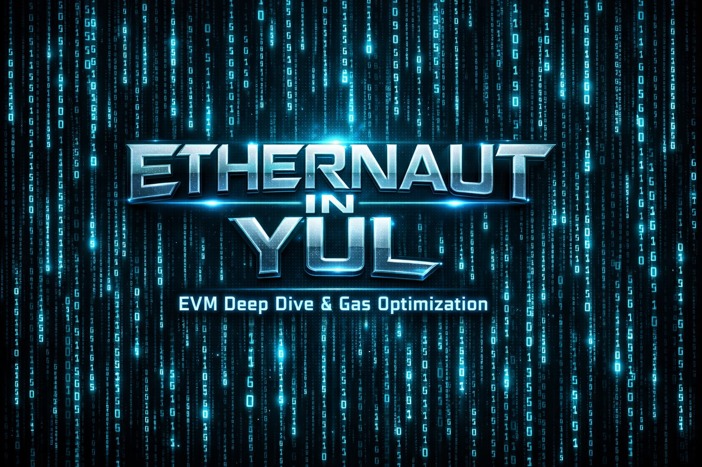

<div align="center">
  
  <br/>
  <br/>
  <h3>
    <i>"Solidity hides the machine. Yul reveals it."</i>
  </h3>
  
  
  

  <br/>
  <br/>
  <p align="center">
    A collection of <b>pure Assembly solutions</b> for OpenZeppelin's Ethernaut CTF.<br/>
    Demonstrating how to interact directly with the Stack, Memory, and Storage <br/>
    to achieve <b>maximum efficiency</b> and <b>surgical precision</b>.
  </p>

</div>

## 🎯 Overview

This repository contains Yul (EVM assembly) implementations of attack contracts for the [Ethernaut](https://ethernaut.openzeppelin.com/) CTF challenges. By solving these challenges in pure assembly, we gain deep insights into:

- **EVM internals**: How the Ethereum Virtual Machine actually works under the hood
- **Gas optimization**: Writing highly efficient code by eliminating Solidity abstractions
- **Security patterns**: Understanding vulnerabilities at the assembly level
- **Low-level operations**: Direct manipulation of storage, memory, and calldata

## 🛠 Technical Stack

- **Language**: Yul (Inline Assembly for Ethereum)
- **Framework**: Foundry (forge, cast, anvil)
- **Testing**: Solidity + Foundry Test Framework
- **Compiler**: Solc with `--strict-assembly` flag
- **Development**: VS Code with Solidity extensions

## 🚀 Getting Started

### Installation

```bash
# Clone the repository
git clone <repository-url>
cd ethernaut-in-yul
# Install dependencies
forge install
```

### Running Tests

```bash
# Run all tests
forge test

# Run specific test contract
forge test --match-contract Fallback

# Run with verbose output (shows traces)
forge test --match-contract Fallback -vvvv

# Run specific test function
forge test --match-test testAttack -vvvv
```

## 🎮 Challenges

View the complete list of challenges and their implementation status in [CHALLENGES.md](CHALLENGES.md).

## 📚 Resources

- [Yul Documentation](https://docs.soliditylang.org/en/latest/yul.html)
- [EVM Opcodes](https://www.evm.codes/)
- [Foundry Book](https://book.getfoundry.sh/)
- [Ethernaut CTF](https://ethernaut.openzeppelin.com/)